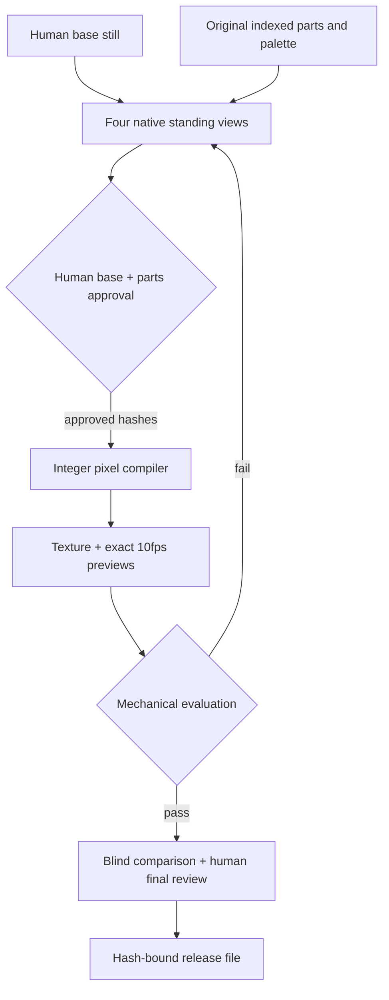

# Pixel-native Woka pipeline: buy the pixels once, reuse their quality

Status: working PR prototype, **not an art-quality victory**. Branch:
`codex/pixel-native-woka`, based on `3c74336e74966e3460f1772337b4c0cfe8ce369d`.

## Decision

Build a small, original 32px parts library, authored/reviewed by a pixel artist,
with a deterministic compiler. Let AI help with concepts and eventually propose
edits to palette indices. Never let a high-resolution generator decide the final
face by resampling. The quality asset is the reusable art library, not a prompt.

**Confidence:** high that this removes the measured resolution-loss failure;
medium that a small original kit is economical; unproven that its art beats
PIPOYA. The implementation proves pixel preservation and rejection of defects.
The included source-matrix character is an engineering fixture with a rather
boxy silhouette and limited robe movement. It is not production art.

## Ranked alternatives

All times/costs below are **planning estimates**, not vendor quotes or measured
quality gains. Labour assumes $40–80/hour for budgeting, not a market rate.
No external service was purchased. API amounts are experiment caps, not asserted
provider prices. Per-character human approval time is included; A/B panel time
is separate. A winning experiment must beat a preregistered held-out set.

| Rank / method | Mechanism and expected gain | Upfront effort and needs | Per character estimate | Primary risk / invalidate if |
|---|---|---|---|---|
| **1. Original pixel parts + deterministic poses** | Place 1px eyes and 3–4 material tones once. Reuse unchanged heads and palette across frames. Target 23–27px front width, 540–720 ink, zero face jitter; A/B gain unmeasured. | Engineer 3–5 days + artist 4–8 days for first useful kit; CPU, Pillow, no API/GPU/training; source kit <50MB initially. | Existing kit: 15–45min human, <$0.01 compute, $10–60 labour. New outfit/shape: 2–6h, $80–480. Compilation target <1s; observed ~12ms for render alone. | Paper-doll sameness, rigid cloth, layer seams. Reject if 6/12 hold-out characters need >2h manual frame repair or blind motion preference regresses. |
| 2. Artist-authored four neutral views + reference-driven part/pose transfer | Segment *native pixels*, translate parts, hand-author exceptional overlaps. Good route for unique silhouettes without building a full kit; eye pixels survive. | 2–4 engineering days; artist 2–6h per four-view character; CPU segmentation/editor; optional concept backend capped $5/character; no training. <5MB/character excluding concepts. | 2–6h ($80–480), CPU seconds. | Masks cut outlines, occluded pixels absent, asymmetric accessories require real opposite views. Reject if occlusion correction costs as much as drawing 12 frames. |
| 3. Palette-index proposal model + constrained local search | Predict discrete colour indices on a 32×32 grid, freeze face/identity anchors and palette; repair small bounded regions. Avoid RGB downscaling, but discrete output alone does not confer taste. | 1–2 weeks integration/research; optional API or local 8–24GB GPU; no training for initial proposal pilot; 1–10GB model/cache. | Budget 5–30min compute/retries + 15–60min human; cap $5 API/character until measured. | Can optimise density while producing nonsense. Reject if fewer than 50% of 20 blinded candidates clear structural/face gates without hand repainting, or no A/B gain. |
| 4. Purpose-trained discrete sprite model on owned data | Learn native art and coordinated poses from commissioned aligned sheets, conditioning on identity/pose/materials. Potential flexibility beyond a kit; no evidence of superiority yet. | 4–8 weeks, not a 2-week promise. Pilot dataset 300–1,000 original sheets, identity-held-out split; 24–48GB GPU, 20–100 GPU-hours initial experiments, 5–50GB dataset/checkpoints. Dataset likely dominates cost. | After training, target 1–10min + 15–45min human; budget $0.10–2 compute, unbenchmarked. At assumed $1–3/GPU-hour pilot compute $20–300, excluding failed runs and art. | Too little diverse legal data; near-copy memorisation; misleading validation on recolours. Reject if identity-held-out A/B loses to parts, or nearest-neighbour audit finds copied output. |
| 5. Vector/3D authoring → orthographic/palette rasterisation | Deterministic poses and controlled silhouettes, then explicit native eye/outline overrides. Helps many outfits, but subpixel features still need pixel rules. | 1–2 weeks engineer + artist; CPU for vectors or ordinary GPU for 3D, no training/API. Assets 10–500MB. | 30–120min authoring/review, seconds rendering, $20–160 labour; negligible compute. | Contour popping and tiny facial features; easy to reproduce the old loss at a new stage. Reject if more than 10% of cells need contour repainting or face gate misses exceed parts. |

The first method has the shortest causal chain between effort and the missing
quality. It also creates reusable hair, scarves, uniforms, body types and cultural
clothing for Universe. Start with a Kuwait-focused capsule: thobe/ghutra,
abaya/hijab, retail uniforms and casual outfits. Commission the source matrices
and their editing/redistribution rights, not just exported PNGs.

## Architecture and data flow

Implemented files:

- `pipeline/pixel_native.py`: schema validation, integer composition, standing
  anchors, approvals, build validation and release copy.
- `pipeline/evaluate_wa.py`: raw measurements, the visible-eyes humanoid profile,
  annotation validation, standalone report/compare CLI.
- `pipeline/blind_ab.py`: local counterbalanced 1:1 study pages, ballot export,
  strict per-pair tally. Nothing is sent to a service.
- `examples/pixel-native/desert_guide.rig.json`: original palette-index parts,
  explicit four views, three positions per layer, embedded review annotations.
- `examples/pixel-native/review.json`: standalone identical annotations for
  comparison commands; tests bind these to the rig.
- `examples/pixel-native/worked-example.json`: actual measurements, reference
  blob/byte hashes and explicit `NOT_ESTABLISHED` quality result; no PIPOYA pixels.

The existing sprite-gen route remains available and its dependency pin stays
unchanged. The new compiler is an **alternative engine module owned here**, not
a vendored/forked sprite-gen. It consumes original parts, not model output.
AI-generated concepts can be identity references after human approval; converting
those concepts into original native parts is an artist step in this version.
There is no automatic image-to-rig conversion hidden behind the CLI.

### Where determinism lives

A part is a rectangular list of strings. Each symbol selects one opaque palette
colour; `.` is transparent. Layer order is array order, positions are integers,
three poses are `[step A, stand, step B]`. The compiler rejects fractional
positions, unknown symbols, oversized parts and any part bounding box clipping.
It neither interpolates, quantises, mirrors nor invents missing views.

A layer uses one part across its three poses. Static heads retain every pixel.
Left and right must have separate view definitions: the example's left source
matrices were authored as a symmetric counterpart, but the runtime never flips
an entire character. An asymmetric bag can therefore be a separate left/right
part. V1 supports translations, not rotations, inverse kinematics, variable z
order or frame-specific cloth deformation. Those are explicit two-week additions.

With Python 3.11 + `requirements.txt`, repeated builds produce identical PNG
bytes in the tested environment. Pixel equality is the durable contract;
compressed byte identity across other libpng/zlib/Pillow builds is not promised.

### Approval boundaries

`anchors` renders **only four standing views**. A human compares them with the
base at 1:1 and zoomed, including landmark annotations and material assignments.
`approve-base --human-reviewed --reviewer NAME` records base bytes, rig bytes and
compiler/gate code hashes. `build` refuses missing/stale approval before composing
walk output. Success is still `AWAITING_FINAL_HUMAN_APPROVAL`.

After the mechanical checks and visual review, `approve-final` revalidates the
current inputs, recompiles and compares actual output pixels, verifies previews,
and binds the final receipt to exact texture bytes. `release` repeats validation
and requires that final receipt before copying to a new destination.

Receipts are **local operator attestations, not authenticated signatures**. They
prevent accidental stale approval, not a developer lying about human review or
editing Python. Tests name their synthetic reviewer `AUTOMATED TEST FIXTURE`;
these are not production approvals. Original model-generated characters retain
the old workflow; this PR does not retrospectively claim they were approved.
A developer can also call the pure renderer for unit-test fixtures. Only the
production CLI enforces the human workflow. The manual game uploader is external.

## Acceptance criteria

All conditions are conjunctive; there is no weighted score that lets more ink
compensate for a missing eye. Detailed definitions and bias limits are in
[pixel-native-evaluation.md](pixel-native-evaluation.md).

| Area | Implemented v1 gate / acceptance |
|---|---|
| Engine | PNG RGBA 96×128; all 12 cells at least 30px high; original row order; exact `[0,1,2,1]` previews, 100ms frames and infinite loop |
| Shape | Down/up each cell width 23–28, ink 540–760; left/right width 18–28, ink 380–760. Preferred art target remains 23–27 and 540–720 for front; gate admits some silhouette variety. |
| Palette/edges | ≤32 opaque sheet colours; no partial alpha; ≥70% dark boundary; largest ink component ≥99.5%; zero isolated 1px components; report 8-connected dark-boundary continuity separately |
| Material tones | ≥2 annotated material ramps, each 3–4 colours; ≥3 tones each used on ≥3 pixels in every cell. This measures tone presence, not correct folds. |
| Face | Down: two distinct adjacent white/pupil pairs separated ≥3px; sides: one pair. Luma white-minus-pupil ≥90, skin-minus-pupil ≥40; dark aligned brow 1–3px above; mouth ≥2px below with ≥30 luma contrast. Every visible-facing frame checked. |
| Identity stability | Head ROI pixel-identical within each walk row; per-row palette total variation ≤0.12, centroid-x range ≤1.25px, silhouette IoU to standing ≥0.78. Cross-view semantic identity remains human-reviewed; palette sameness alone is insufficient. |
| Motion | Three distinct poses per row; neutral feet share baseline 32; outer frames alternate the lifted foot and retain one planted foot. Pose inference depends on separately reviewed foot ROIs. |
| Human victory | Per candidate/reference pair: ≥40 independent non-author raters, 40–60% counterbalance; overall and face candidate wins ≥65% with Wilson 95% lower bound >50%. Ties count as non-wins. Other criteria candidate win share ≥50% as warning thresholds, not equivalence proof. |
| Shipping | Human base AND final texture approvals required. A/B success does not create either approval. Quality win applies only to that tested pair. |
| Reproducibility | Existing self-test passes, all committed textures pass, new integration/negative tests pass, six seeded source defects fail their named assertion tests. No model credentials, GPU or network required for tests. |

## Failure modes visible to the operator

| Symptom / error | Meaning | Action |
|---|---|---|
| `HOLD: stale base approval: rig_sha256` | Parts or annotations changed since review | Render anchors and review the base/parts again |
| `clipping a part is forbidden` | A limb/hat extends outside32px | Reposition or redraw the native part; no crop-to-fit |
| `eye contrast` / `brow` / `mouth` | A real feature pixel disappeared or annotation is wrong | Inspect 1:1 and 8×; redraw the feature or correct reviewed landmarks |
| `head/face jitter` | Head region changed between walk frames | Fix the layer masks/order; do not increase the tolerance to hide it |
| `middle frame is not planted` | Standing column accidentally contains a step | Restore neutral pose to column 1 |
| `lacks three used shading tones` | A material flattened or declared colours do not match | Rework the actual material clusters, not add test-only specks |
| `missing required previews` | Review material is incomplete | Rebuild into a fresh output directory |
| `stale build` / `differs from compiled rig` | Output/inputs altered | Rebuild and repeat final review |
| Mechanical PASS, A/B NOT_ESTABLISHED | Meets profile, has not demonstrated superior art | Keep as candidate; commission/refine art or retain defaults |

## Two days

Day 1: land the compiler/gates, pair an artist with one approved base, redraw one
original front face/head and three other views natively, attach simple feet/arms.
Reuse this PR's code, but do not assume the fixture is the desired style.
Day 2: artist refines two silhouettes and material ramps, review four walk cycles
at 1:1 beside defaults on light/dark map patches. Prepare blind pages for 3
matched candidates. Run a small pilot to discover obvious problems; **do not
call 5 informal opinions a statistically demonstrated win**. Recruit the 40-rater
panel separately. Budget: 1 engineer + 1 artist, 8–16 artist-hours ($320–1,280
assumption), CPU only. Smallest real quality improvement: preserve deliberate
face and clothing pixels across all frames. No promise of beating PIPOYA in two
days without artist work and an actual panel.

## Two weeks

- Days 1–2: capsule art direction, rights/provenance template, preregister 12
  held-out identities including four skin tones, long/short garments, headwear,
  uniforms and asymmetric accessories. Do not select only successful outputs.
- Days 3–5: artist creates 4 body silhouettes, 6 head/hair/headwear groups and 6
  outfits at native scale. Build their compatibility matrix rather than assuming
  every possible combination fits. Engineer adds importer/exporter for indexed
  part PNGs and an editor-friendly manifest.
- Days 6–8: explicit per-pose part variants for cloth/occlusion and per-view layer
  order; test planted feet, seams and lost accessory handedness. Add bob only
  through a new profile with declared head offsets; do not loosen v1.
- Days 9–10: produce the held-out characters; audit original source/rights, freeze
  hashes and benchmark pairing before collecting votes. Improve annotations
  through independent review, not by making failing candidates pass.
- Days 11–14: counterbalanced panel with ≥40 raters per pair. The same raters may
  judge multiple identities, but do not count their answers as independent
  samples in a pooled test. Report all pairs; a proposed portfolio release bar
  is ≥10/12 per-pair wins and no repeated motion/identity failure. This bar is a
  product criterion, not a implemented multi-pair statistical test. Assess
  broader confidence with rater-cluster analysis before marketing superiority.
  Obtain final human signoff on every released texture.

Staffing: one engineer and one pixel artist working together, with a part-time
review coordinator. Budget artist 40–64h ($1,600–5,120 at stated assumptions),
engineering 8–10 person-days, plus panel incentives chosen by you. Deliverables:
original editable kit, ≥12 characterized outputs, reproducible manifests,
measured repair minutes/character, complete vote record, and a pass/fail release
list. The two-week product is this curated kit, not a purpose-trained foundation
model or a fully automatic photo-to-avatar service.

## What I could not verify

- **Art superiority:** no independent blind human votes, artist finish or final
  approval obtained. Need a pixel artist and the proposed panel; existing
  owners should not be the only raters. No candidate was uploaded to the game.
- **Identity from arbitrary input:** no automated base-to-parts conversion is
  implemented. Need 12 approved diverse bases and timed artist conversion trials.
- **Production motion:** checked engine source and actual pixels, not a running
  Phaser instance with moving maps/camera. Need a staging play session on the
  target displays; keep map zoom separate from the fixed character format.
- **Training rights:** no PIPOYA training/fine-tuning/distillation permission
  located. Need written permission covering dataset/model/output distribution,
  or an entirely owned/explicitly permitted dataset. Do not train pending that.
- **Model alternatives:** no paid API calls, GPU runs, dataset acquisition or
  training. Their quality/cost ranges are proposed experiment budgets.
- **Artist economics:** no quoted rates or measured 100-character batch. Need a
  paid 3-character pilot with time tracking before staffing a catalogue.
- **Browser study rendering:** HTML generation/counterbalancing and ballot
  statistics are unit tested; actual browser zoom, CSS-pixel display and panel
  behaviour require an operator check. OS scaling may map 1 CSS px to >1 device
  pixel. The study matches the game's logical pixel size, not every physical
  monitor's pixel grid.
- **Account authenticity:** local approval/ballot JSON is an honour-system
  record. It does not prove a person looked at the art or deduplicate people
  using different IDs. Coordinator must validate participants externally.
